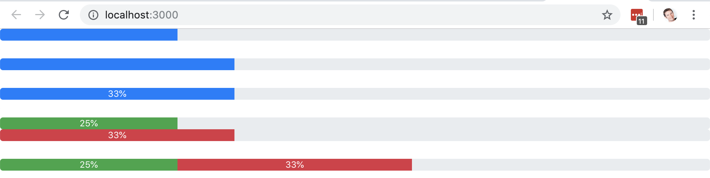

# Activity 02: Working With JSX and React

## Objectives:

* Customize a create-react-app hello world app with your own JSX
* Understand how JavaScript is injected into JSX
* Understand how external CSS and JavaScript can be used in React apps
* Build the first piece of our pizza tracker app using Bootstrap

## Exercise:

1. Use `create-react-app` to create a new application:
    * `create-react-app activity-02`
2. Make changes to `public/index.html` to include bootstrap CSS classes
```html
<link rel="stylesheet" href="https://cdnjs.cloudflare.com/ajax/libs/twitter-bootstrap/4.0.0/css/bootstrap.min.css"/>
```
3. Run the application in development mode:
    * `npm run start`
4. Make changes to the `App.js` file to 
    * Add a progress bar to the app with a fixed width
    * Add a progress bar to the app with a width defined by a JavaScript variable
5. Observe that your app includes a progress bar.

### Hints: 
* Refer to Bootstrap 4 progress bar component documentation: https://getbootstrap.com/docs/4.0/components/progress/
* Remember that JSX expects `className` instead of `class`
* Remember to escape JSX with `{ }` to access JavaScript variables
* Remember that the `style` attribute expects an object: `{ { ... } }`

## Bonus:

If you finish this exercise early, try:
1. Creating a layered progress bar to show separate segments.
2. Placing a label on your progress bar to distinguish segments.
3. Using mulitple colors in your progress bar to distinguish segments,.

## Success Criteria:

