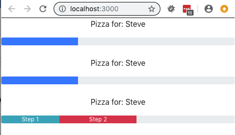

# Activity 03: Working With Props and Validation

## Objectives:

* Add a new functional component to to your App
* Extract the progress bar from the previous activity into new component
* Understand how props are passed to a functional component
* Understand prop validation

## Exercise:

1. Use `create-react-app` to create a new application, or copy your existing one:
    * `create-react-app activity-03`
2. Make changes to `public/index.html` if you created a new application to include bootstrap CSS classes
```html
<link rel="stylesheet" href="https://cdnjs.cloudflare.com/ajax/libs/twitter-bootstrap/4.0.0/css/bootstrap.min.css"/>
```
3. Run the application in development mode:
    * `npm run start`
4. Create a `PizzaTracker.js` file and:
    * Re-implement / extract the progress bar as a functional component
    * Allow a prop `progress` to be used to specify the width of the progress bar
    * Add PropType validation for `progress` prop to be a number, and make it optional
    * Add a customer name heading to the progress bar
    * Allow a prop `customerName` to be used to specify the contents of the progress bar
    * Add PropType validation for `customerName` prop to be a string, and make it required
    * Add defaultProps for `progress` to be 33%
    * Add defaultProps for `customerName` to be `John`
    * Export the component
5. Make changes to the `App.js` file to 
    * Import your PizzaTracker component
    * Render it with no props
    * Render it again with prop `progress` = 33%
6. Observe that your app includes your progress bar component.

## Hints:
* A JavaScript float is a `number` PropType

## Bonus:

If you finish this exercise early, try:
1. Changing the PropType validation to `isRequired` and observe what happens in the render with no props.
2. Passing in additional props as an array of objects to control:
    * Two segment progress bar
    * Each segment has its own label
    * Each segment has its own color
    * Each segment has its own percentage
3. Using PropTypes.shape() to more completely specify the format of the array of objects prop
            
## Success Criteria:

