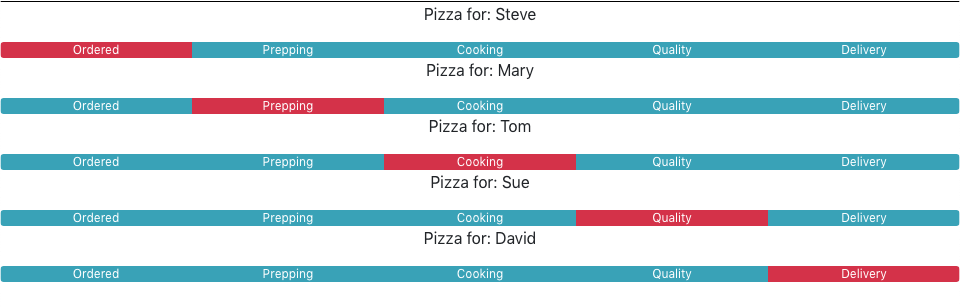

# Activity 04: Working With Lists and Keys

## Objectives:

* Understand the ways that you can display list of components 
* Understand why keys are important when working with lists

## Exercise:

1. Use `create-react-app` to create a new application, or copy your existing one:
    * `create-react-app activity-04`
2. Make changes to `public/index.html` if you created a new application to include bootstrap CSS classes
```html
<link rel="stylesheet" href="https://cdnjs.cloudflare.com/ajax/libs/twitter-bootstrap/4.0.0/css/bootstrap.min.css"/>
```
3. Run the application in development mode:
    * `npm run start`
4. Add the solved PizzaTracker.js component from the previous activity to your project.
5. Refactor the PizzaTracker component so that:
    1. It takes two props:
        * `customerName` as a string
        * `progress` as number from 0 to 4
    2. It renders 5 equally sized segments with labels: ordered, prepping, cooking, quality, delivery
    3. The segment corresponding to the `progress` prop is colored differently than the others
6. Make changes to the `App.js` file to:
    * Create a variable with an array of order objects that include customerName and progress
        * Steve, 0
        * Mary, 1
        * Tom, 2
        * Sue, 3
        * David, 4
    * Use Array.map() to iterate over the orders and render a pizza tracker for each customer
    * Use an appropriate key to satisfy React's key constraint on children in a list

## Hints:

* Try using the array index as a key
* Try creating a new unique property in your object to use as the key

## Success Criteria:
