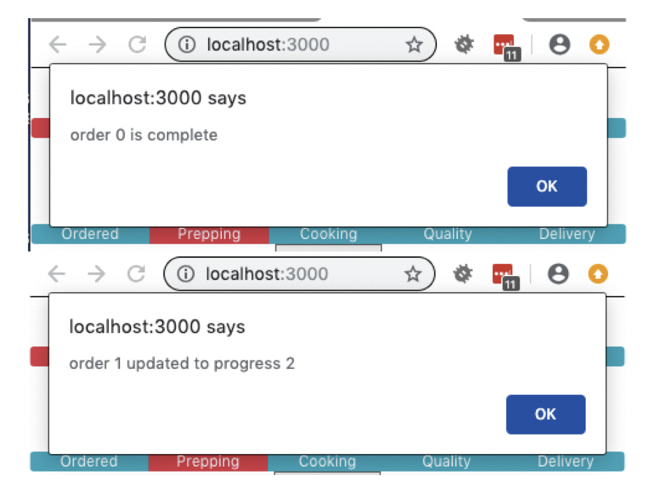

# Activity 05: Event Handlers

## Objectives:

* Understand how to add event handlers to HTML elements
* Understand how to push state up to parent component

## Exercise:

1. Copy the previous (yours or solved) activity to a new directory
    * `cp -R activity-04 activity-05`
2. Run the application in development mode:
    * `npm run start`
3. Add the solved `PizzaTracker.js` component from the previous activity to your project.
4. Modify `PizzaTracker.js` to:
    * Add a Complete button
    * Add an onClick event handler to each progress bar segment that calls a function with the selected progress number.
    * Add an onClick event handler to the Complete button that calls a function
    * Add `onUpdateProgress` function to alert when an order is updated
    * Add `onCompleteOrder` function to alert when an order is marked completed
5. Click on the button and change the text and verify that you see an alert
6. Modify `App.js` to:
    * Pass an `onUpdateProgress` prop with a function that alerts
    * Pass an `onCompleteOrder` prop with a function that alerts
7. Modify `PizzaTracker.js` to:
    * Remove the alerts from this component (in favor of alerts at the `App.js` level)
8. Click on the button and change the text and verify that you see an alert from the `App.js` handler.

## Hints:

* You may need to use an arrow function to correctly send the order progress event.

## Success Criteria:
