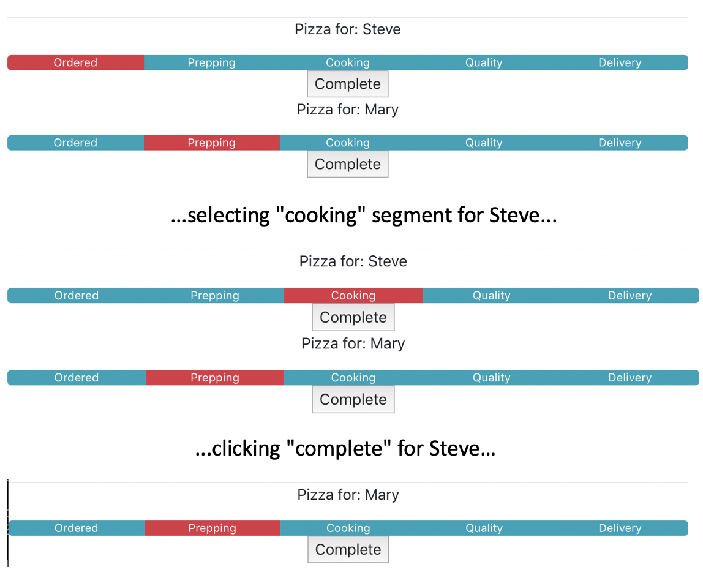

# Activity 06: State with Hooks 

## Objectives:

* Understand how to store state in a functional component
* Understand how updating state causes components to re-render
* Understand the useState hook

## Exercise:

1. Copy the previous activity (yours or solved) to a new directory
    * `cp -R activity-05 activity-06`
2. Run the application in development mode:
    * `npm run start`
3. Make changes to `App.js` to store state for it's children:
    * Remove the alerts from the previous activity
    * Add `setOrders` function and `orders` variable via the useState() hook
    * Update the `updateProgress` function to modify the current order state with the new progress value for the indicated order
    * Update the `completeOrder` function to modify the current order state, removing the indicated order
    * Call the `setOrders` hook from both functions to store the new state and cause the PizzaTracker components to re-render 
4. Verify that you can click on a different segment of an individual PizzaTracker and see that the new segment is selected

## Hints:

* Don't forget to `import {useState} from 'react'`
* Remember that the list of orders is an array.  In JavaScript arrays are refs, not values.  React won't know that array has changed unless you clone it.

## Success Criteria:
