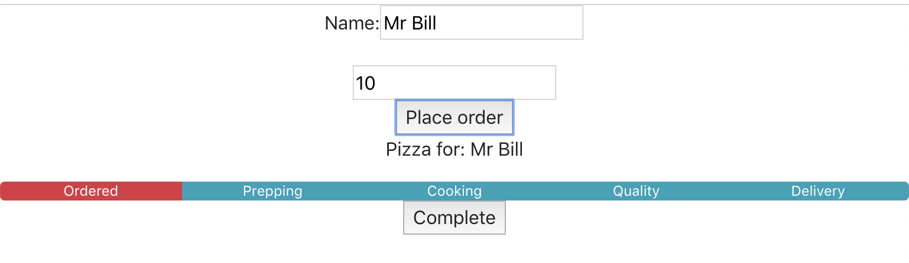

# Activity 07: Form Control

## Objectives:

* Understand how to use a controlled form
* Understand how to override form submission
* Understand how to pass an object to parent
* Understand how to update parent state when adding a new object

## Exercise:

1. Copy the previous activity (yours or solved) to a new directory:
    * `cp -R activity-06 activity-07`
2. Run the application in development mode:
    * `npm run start`
3. Create a new file `OrderForm.js` for the order form component
4. Modify the `OrderForm.js` file to make a stateful functional component:
    * Create an input element that takes the customer name
    * Create an input element that takes the pizza size
    * Create a submit button that allows the user to submit the order
    * Setup a `formUpdate` handler to manage receiving `onChange` events from input fields and place them into state
    * Setup a `formSubmit` handler to manage receiving `onClick` events from the submit button
    * Add an onNewOrder prop to your OrderForm component
5. Modify the `App.js` file to:
    * Import your OrderForm component
    * Render your OrderForm component
    * Pass an onNewOrder prop to your OrderForm component
    * Setup a `newOrder` handler to manage receiving `onNewOrder` events from the OrderForm component
    * Implement the ability for the `newOrder` handler to the new order state to the list of orders:
        * In a similar manner to the `updateProgress` and `completeOrder` handlers from `06-state-hooks` activity
6. Observe that submitting an order creates a new order in the list of pizza orders.
7. Observe that you can click on a pizza tracker segment for the new order and see it update in the list of orders.

## Hints:

* Don't worry about styling right now.  Remove `import ./App.css` if needed.

## Success Criteria:

