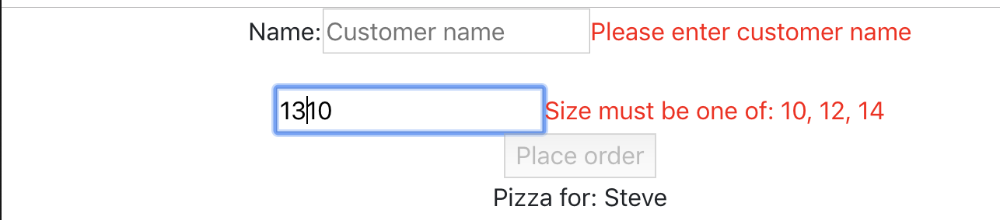

# Activity 08: Form Validation and Using Refs

## Objectives:

* Add some validation to our form
* Use a ref to access the DOM directly
* Clear the form on submit
* Set the focus on submit

## Exercise:

1. Copy the previous activity (yours or solved) to a new directory
    * `cp -R activity-07 activity-08`
2. Run the application in development mode:
    * `npm run start`
3. Make changes to `OrderForm.js` to add validation:
    * Create a new `` or `
` element to hold an error message for invalid customer name.
    * Create a new `` or `
` element to hold an error message for invalid pizza size.
    * In your orderForm state, add additional booleans for `nameValid` and `sizeValid`
    * In the update event handler, add code to verify that the `customerName` input has a value and set the `nameValid` boolean appropriately.
    * In the update event handler, add code to verify that the `pizzaSize` input is set to a valid value (10, 12, 14) `sizeValid` boolean appropriately.
    * Conditionally render your invalid customer name and invalid pizza size error messages based on the orderForm state.
    * In the render function, add code to disable the place order button if the form is invalid.
4. Make changes to `OrderForm.js` to reset the state and select an input on submit.
    * In your submit handler, clear the order form state upon submit.
    * Use a useRef to access the customer name field directly.
    * In your submit handler, set the focus on the customer name field upon submit.

## Bonus:

* Place a ref on the customer name input and try to clear it in the submit handler with `customerName.current.value = "";`
    * Why doesn't this work?
* Try changing your form from controlled to un-controlled with useRef on customerName.
    * Will validation still work?
    
## Success Criteria:
