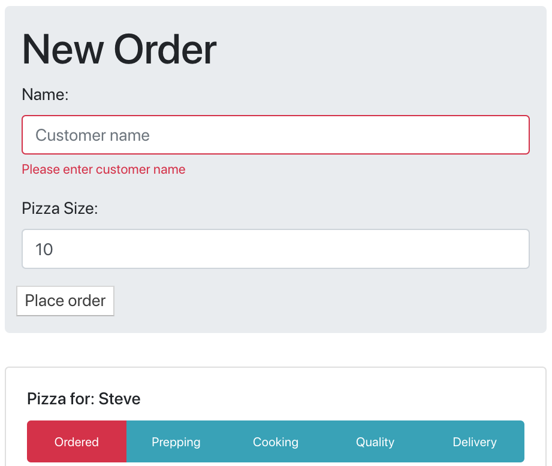

# Activity 09: Styling

## Objectives:

* Using a combination of styling techniques, apply styles to your pizza tracker

## Exercise:

1. Copy the previous activity (yours or solved) to a new directory
    * `cp -R activity-08 activity-09`
2. Run the application in development mode:
    * `npm run start`
3. Make changes to your project to add styles in various ways:
    * className referencing Bootstrap classes
    * `style={{}}` property injection
    * `import style.css` to component
    * `import Component.module.css` to component

## Success Criteria:

## Solution

* Up to you!  Look at `10-final/solved` for an approach.